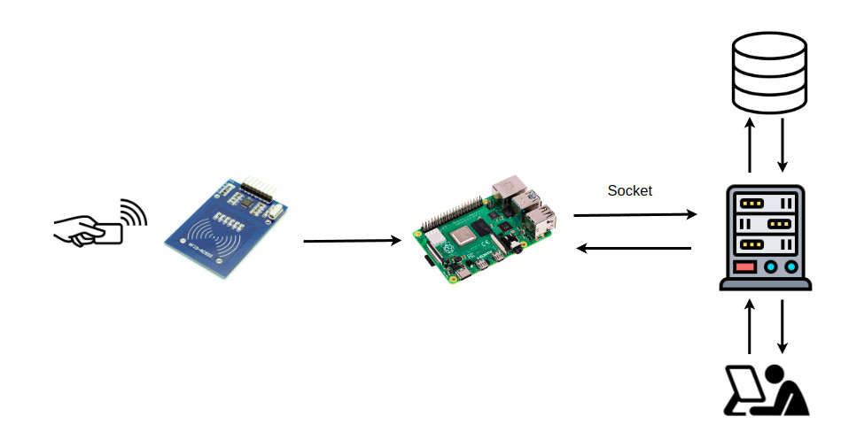
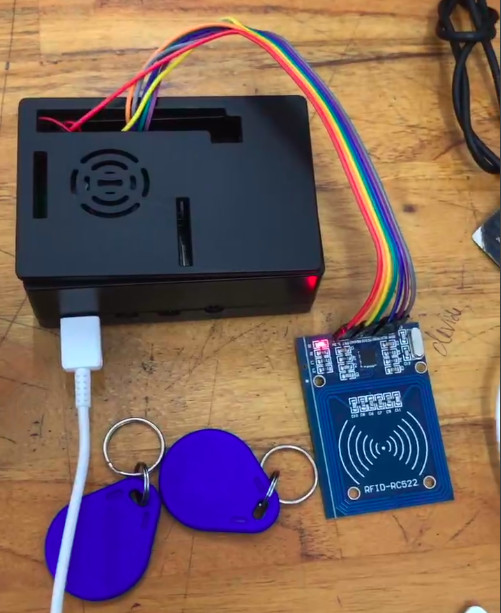
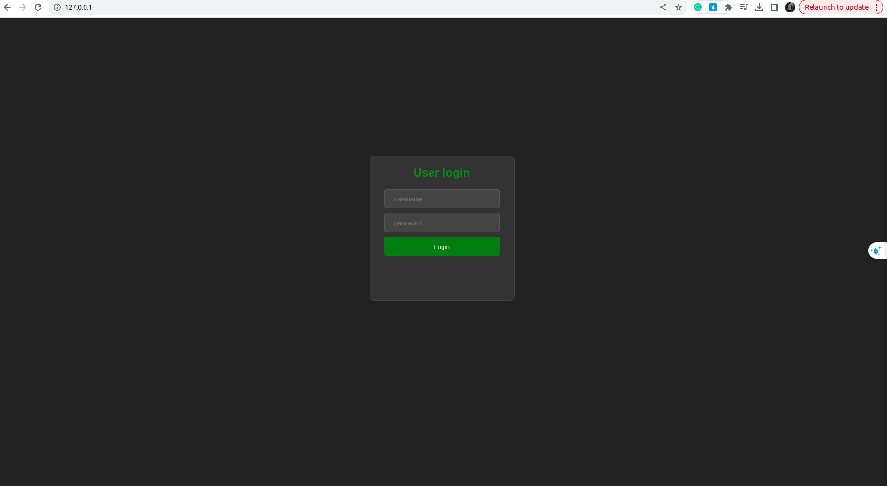
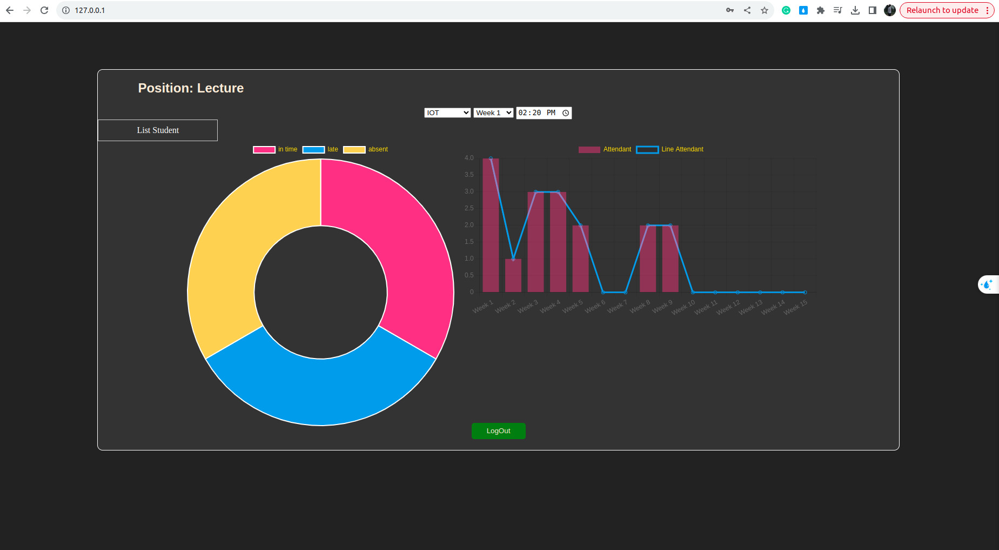
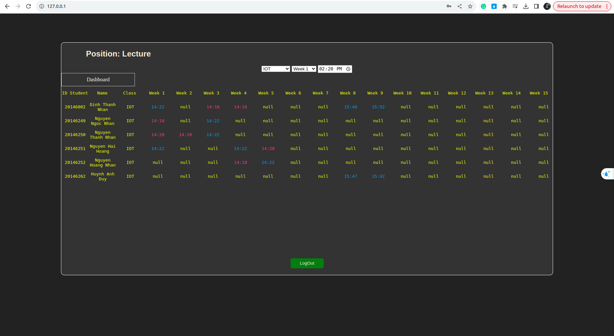
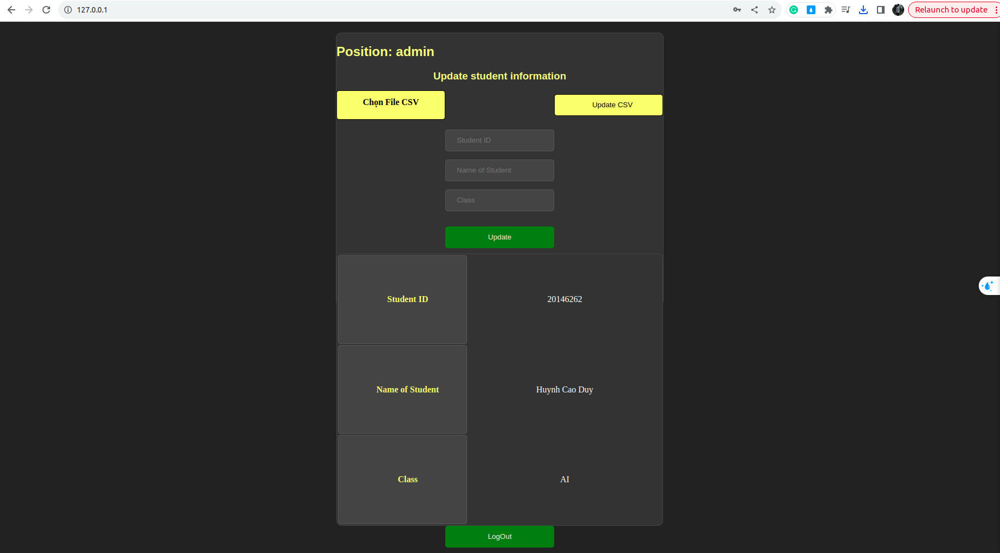

# Smart Attendance Monitoring System (IOT)



## To do task
- [x] Doughnut chart
- [x] Mixed chart
- [x] Show student list attendance
- [x] Filter: Class, Week, Time
- [x] Change text color according to attendance time status
- [x] Manual registration
- [x] Convert csv file to database (SQL)
- [x] Displays the latest importer information


## Clone project
```
git clone https://github.com/tooniesnguyen/Smart_Attendance_Monitoring_System.git

cd Smart_Attendance_Monitoring_System
```

## On the server


### Import and run  database
```
$ cd database
$ mysql -u [username] -p [new_database] < IOT_Face.sql
ctrl + D
$ sudo /etc/init.d/mysql start
$ mysql -u [username] -p
```

### Add htdocs
```
$ cd statics
$ sudo bindfs -o nonempty . /var/www/html
```

### Setup and run server
```
# With conda env
$ bash setup.sh
$ python server.py

# Without conda env
$ bash setup.sh

# Config hostname and port
$ python server.py
```
### Open browse
http://127.0.0.1/


## On the client


### Connecting

| Board pin name | Board pin | Physical RPi pin | RPi pin name | Beaglebone Black pin name |
|----------------|-----------|------------------|--------------| --------------------------|
| SDA            | 1         | 24               | GPIO8, CE0   | P9\_17, SPI0\_CS0         |
| SCK            | 2         | 23               | GPIO11, SCKL | P9\_22, SPI0\_SCLK        |
| MOSI           | 3         | 19               | GPIO10, MOSI | P9\_18, SPI0\_D1          |
| MISO           | 4         | 21               | GPIO9, MISO  | P9\_21, SPI0\_D0          |
| IRQ            | 5         | 18               | GPIO24       | P9\_15, GPIO\_48          |
| GND            | 6         | 6, 9, 20, 25     | Ground       | Ground                    |
| RST            | 7         | 22               | GPIO25       | P9\_23, GPIO\_49          |
| 3.3V           | 8         | 1,17             | 3V3          | VDD\_3V3                  |

### Setup and run client
```
$ pip install -r requirements.txt
$ client.py
```


## My table of database: [IOT_Face.sql](./database/IOT_Face.sql)
```
+----+----------+----------------------+----------+-------+-------+-------+-------+-------+------+------+-------+-------+------+------+------+------+------+------+
| id | sid      | name                 | class    | W_1   | W_2   | W_3   | W_4   | W_5   | W_6  | W_7  | W_8   | W_9   | W_10 | W_11 | W_12 | W_13 | W_14 | W_15 |
+----+----------+----------------------+----------+-------+-------+-------+-------+-------+------+------+-------+-------+------+------+------+------+------+------+
| 48 | 20146002 | Dinh Thanh Nhan      | IOT      | 14:22 | NULL  | 14:18 | 14:18 | NULL  | NULL | NULL | 15:49 | 15:52 | NULL | NULL | NULL | NULL | NULL | NULL |
| 49 | 20146249 |  Nguyen Ngoc Nhan    | IOT      | 14:18 | NULL  | 14:22 | NULL  | NULL  | NULL | NULL | NULL  | NULL  | NULL | NULL | NULL | NULL | NULL | NULL |
| 50 | 20146250 |  Nguyen Thanh Nhan   | IOT      | 14:20 | 14:20 | 14:22 | NULL  | NULL  | NULL | NULL | NULL  | NULL  | NULL | NULL | NULL | NULL | NULL | NULL |
| 51 | 20146251 |  Nguyen Hai Hoang    | IOT      | 14:22 | NULL  | NULL  | 14:22 | 14:20 | NULL | NULL | NULL  | NULL  | NULL | NULL | NULL | NULL | NULL | NULL |
| 52 | 20146252 |  Nguyen Hoang Nhan   | IOT      | NULL  | NULL  | NULL  | 14:18 | 14:22 | NULL | NULL | NULL  | NULL  | NULL | NULL | NULL | NULL | NULL | NULL |
| 53 | 20146249 |  Nguyen Ngoc Nhan    | AI       | NULL  | NULL  | NULL  | NULL  | NULL  | NULL | NULL | NULL  | NULL  | NULL | NULL | NULL | NULL | NULL | NULL |
| 54 | 20146255 |  Nguyen Thanh Nhan_A | AI       | NULL  | NULL  | NULL  | NULL  | NULL  | NULL | NULL | NULL  | NULL  | NULL | NULL | NULL | NULL | NULL | NULL |
| 55 | 20146256 |  Do Hai Hoang        | AI       | NULL  | NULL  | NULL  | NULL  | NULL  | NULL | NULL | NULL  | NULL  | NULL | NULL | NULL | NULL | NULL | NULL |
| 56 | 20146257 |  Huynh Anh Duy       | AI       | NULL  | NULL  | NULL  | NULL  | NULL  | NULL | NULL | NULL  | NULL  | NULL | NULL | NULL | NULL | NULL | NULL |
| 57 | 20146261 |  Ta Hai Hoang        | Embedded | NULL  | NULL  | NULL  | NULL  | NULL  | NULL | NULL | NULL  | NULL  | NULL | NULL | NULL | NULL | NULL | NULL |
| 58 | 20146262 |  Huynh Cao Duy       | Embedded | NULL  | NULL  | NULL  | NULL  | NULL  | NULL | NULL | NULL  | NULL  | NULL | NULL | NULL | NULL | NULL | NULL |
| 59 | 20146262 | Huynh Anh Duy        | IOT      | NULL  | NULL  | NULL  | NULL  | NULL  | NULL | NULL | 15:47 | 15:42 | NULL | NULL | NULL | NULL | NULL | NULL |
| 60 | 20146261 |  Ta Hai Hoang        | AI       | NULL  | NULL  | NULL  | NULL  | NULL  | NULL | NULL | NULL  | NULL  | NULL | NULL | NULL | NULL | NULL | NULL |
| 61 | 20146262 |  Huynh Cao Duy       | AI       | NULL  | NULL  | NULL  | NULL  | NULL  | NULL | NULL | NULL  | NULL  | NULL | NULL | NULL | NULL | NULL | NULL |
+----+----------+----------------------+----------+-------+-------+-------+-------+-------+------+------+-------+-------+------+------+------+------+------+------+
```

## Result

### GUI Login



### GUI Lecture



### GUI Admin

